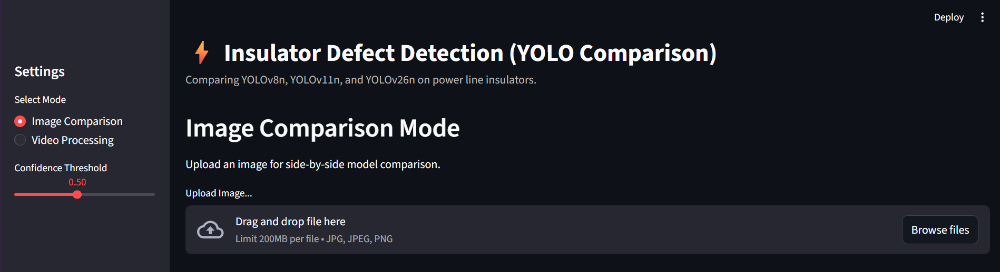
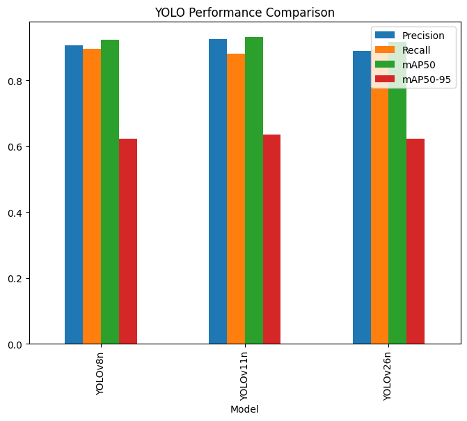
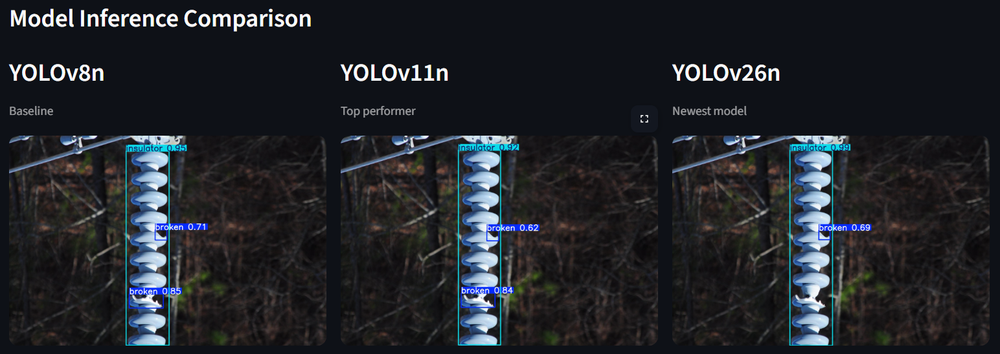

# Insulator Defect Detection with YOLO

Comparative insulator defect detection using YOLOv8n, YOLOv11n, and YOLOv26n with image and video inference through a Streamlit app.



## Overview

This project benchmarks three Ultralytics YOLO models (v8n, v11n, v26n) on an insulator defect detection dataset.  
It focuses on both detection quality and practical deployment, with a Streamlit interface that supports image and video inference to make the differences between models visually clear.

## Key Features

- Training and evaluation of YOLOv8n, YOLOv11n, and YOLOv26n on the same insulator dataset.  
- Side-by-side visual comparison of detections on test images.  
- Streamlit app for interactive image upload and multi-model video processing.  
- Simple, lightweight repository without bundled training dataset or full `runs` folder.

## Dataset

- Task: Insulator defect detection on overhead line insulators.  
- Format: YOLO-style dataset with train/validation/test splits and bounding box annotations.  
- Source: Publicly available insulator dataset used for training and evaluation.  

> Note: The full dataset is not included in this repository to keep it lightweight.

## Model Comparison

The project compares three models under identical training and evaluation settings, using metrics such as precision, recall, and mAP on the held-out test set.



YOLOv11n achieved the best overall precision and mAP in this setup, while YOLOv8n showed slightly higher recall and YOLOv26n performed worst among the three.



The visual comparison image shows typical detection outputs from each model, making the qualitative differences easy to see at a glance.

## Streamlit App

The Streamlit app allows users to:

- Upload an image and see detections from all three models side-by-side.  
- Upload a video and generate processed outputs for comparison across the models.  

To run the app locally:

```bash
pip install -r requirements.txt
streamlit run app.py
```

If your main app file is inside the `insulator_project` folder, update the command accordingly.

## Repository Structure

- `YOLO.ipynb` – main notebook for dataset inspection, training, and evaluation.  
- `insulator_project/` – app code, configuration, and supporting scripts.  
- `images/` – selected screenshots for the README.  
- `requirements.txt` – Python dependencies for running the project.

## Future Work

- Add more detailed ablation studies using different image sizes, epochs, or augmentation strategies.  
- Extend the app to support model selection and confidence-threshold tuning from the UI.  
- Explore exporting the best model for faster edge deployment.

## Author

Abhishek Pawar